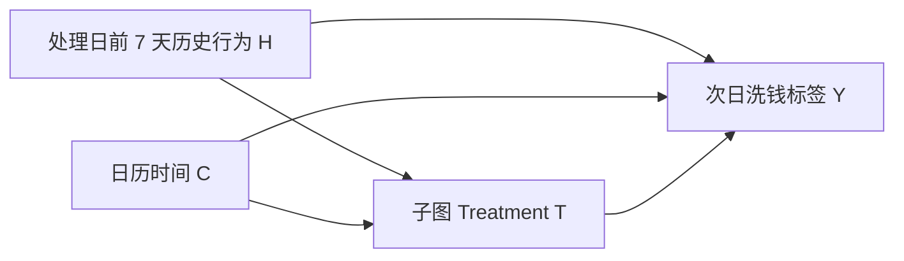
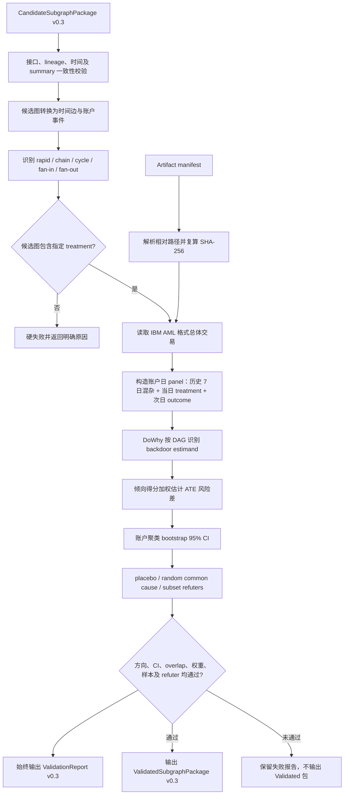

# AML 子图识别与 DoWhy 因果实验工作流

## 1. Hypothesis

> 在可观测历史行为相近的账户中，当日发生快速资金中转（收款后 1 小时内，以原金额
> 80%–120% 的同币种金额转出）会提高该账户次日涉及洗钱标记交易的概率。

估计目标是账户日层面的 ATE 风险差：

```text
E[Y(rapid_transfer=1) - Y(rapid_transfer=0)]
```

## 2. 变量表

| 类型 | 变量 | 构造方式 |
|---|---|---|
| Treatment | `rapid_transfer` | 账户收到款项后 1 小时内，以 0.8–1.2 金额比、同币种转出则为 1 |
| Alternative treatment | `chain_member` | 属于同日时间有序且金额连续的 A→B→C 子图 |
| Alternative treatment | `cycle_member` | 属于同日时间有序的二环或三环子图 |
| Alternative treatment | `fan_in_member` | 同日从至少 3 个不同账户向中心账户归集 |
| Alternative treatment | `fan_out_member` | 同日从中心账户向至少 3 个不同账户分散 |
| Outcome | `laundering` | 账户次日任一关联交易的 `Is Laundering=1` |
| Confounder | `hist_event_count` | 处理日前 7 天交易事件数 |
| Confounder | `hist_in_amount`, `hist_out_amount` | 处理日前 7 天收款/付款金额 |
| Confounder | `hist_in_count`, `hist_out_count` | 处理日前 7 天收款/付款笔数 |
| Confounder | `hist_cross_bank_count` | 处理日前 7 天跨行事件数 |
| Confounder | `hist_laundering_count` | 处理日前 7 天历史标签事件数 |
| Confounder | `hist_counterparty_days` | 处理日前 7 天交易对手活跃度 |
| Confounder | `hist_currency_days` | 处理日前 7 天币种活跃度 |
| Confounder | `day_of_week`, `day_index` | 周内季节性与时间趋势 |

所有 confounder 都在 treatment 发生前构造；outcome 使用下一日，避免同时期信息泄漏。

## 3. DAG



精确的 DoWhy DOT 图在 `config/dag.dot`。运行时仅替换 treatment 节点，调整集固定为上表
11 个历史与日历变量。

## 4. 完整流程



## 5. 判定与输出

通过规则同时要求：效应方向符合预期；聚类 bootstrap CI 排除 0；倾向得分落在
0.05–0.95 的样本比例至少 0.80；最大非稳定 IPW 不超过 20；treated/control 均至少
100；refuter 稳定且至少运行 20 次；成功 bootstrap 至少 50 次。

业务汇总格式：

```text
Hypothesis:
  快速资金中转会提高次日洗钱风险。

Causal Effect:
  treatment、ATE risk difference、95% CI、样本量。

Validation:
  overlap、最大权重、refuters、子图成员识别、逐项判定。

Confidence:
  HIGH / MEDIUM / LOW；这是诊断等级，不是后验概率。
```

规范输出以 `validation_report_v03.json` 为准；通过时
`validated_subgraph_v03.json.validation` 引用同一份报告内容。
